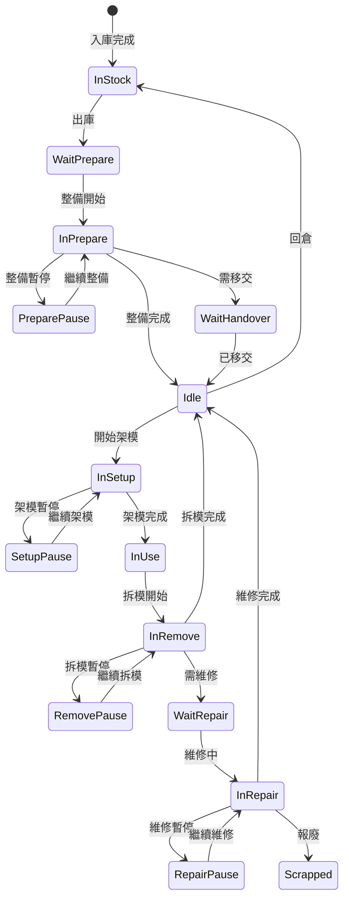

# 🧩 ZeroMES 模治具管理模組功能與規劃說明

---

## 📁 模組簡介

模治具管理模組主要支援模具、治具、刀具等生產用具的全生命週期管理，包含：
- 基本資料管理
- 整備、出入庫、架模/拆模、保養與維修作業
- 報廢與穴位調整記錄
- 使用履歷與目前狀況查詢

---

## 🔧 後台功能（系統管理）

| 模組 | 功能描述 |
|------|----------|
| **模治具資料管理** | 建立/編輯模治具資訊，依類型顯示不同欄位。包含：UID、名稱、供應商、可生產料號、預設儲位、壽命、屬性模板（如穴數） |
| **模治具控制設定** | 控制狀態轉移邏輯設定（如需整備、需移交等） |
| **儲位管理** | 建立/維護儲位清單、儲位條碼、現況 |
| **屬性模板設定** | 依模治具類型定義顯示欄位（如模具顯示穴數、起始號等） |

---

## 🛠️ 前台功能（作業操作）

### 🟠 設備端作業

| 功能 | 說明 |
|------|------|
| 待整備查詢 | 查詢是否需整備（依工單或模具） |
| 整備作業 | 狀態流程：`WaitPrepare → InPrepare → Pause → InPrepare → (Idle / WaitHandover)` |
| 出庫 | 狀態轉為 WaitPrepare / WaitHandover 並清除儲位 |
| 入庫 | 指定儲位，狀態為 InStock |
| 移交 | 狀態轉為 Idle |
| 架模 | 綁定模具與機台，狀態：`Idle → InSetup → Pause → InSetup → InUse` |
| 拆模 | 狀態：`InUse → InRemove → Pause → InRemove → (WaitRepair / Idle)` |

---

### 🔴 維修與保養

| 功能 | 說明 |
|------|------|
| 維修作業 | 記錄原因、方式、工時；狀態：`WaitRepair → InRepair → Pause → InRepair → (Scrapped / Idle)` |
| 報廢 | 記錄報廢原因，狀態為 Scrapped |
| 保養作業 | 根據壽命/次數提示預警，記錄保養項目與檢查項目 |
| 穴位調整 | 記錄塞穴、取消塞穴與歷程 |

---

### 🔍 查詢功能

| 功能 | 說明 |
|------|------|
| 使用履歷查詢 | 模治具歷史紀錄（使用工單、設備等） |
| 狀況查詢 | 顯示當前狀態（在製中、儲位中、已報廢） |

---

## 🔁 建議畫面與 API 對照表

| 分類 | 前端頁面 | API 建議路由 |
|------|----------|----------------|
| 基本設定 | `ToolForm.razor`、`ToolListPage.razor` | `/api/tool` |
| 控制設定 | `ToolControlSettingPage.razor` | `/api/tool/control-setting` |
| 儲位管理 | `StorageLocationPage.razor` | `/api/storage` |
| 整備作業 | `ToolPreparePage.razor` | `/api/tool/prepare` |
| 出入庫作業 | `ToolStockPage.razor` | `/api/tool/inout` |
| 架模作業 | `ToolSetupPage.razor` | `/api/tool/setup` |
| 拆模作業 | `ToolRemovePage.razor` | `/api/tool/remove` |
| 維修作業 | `ToolRepairPage.razor` | `/api/tool/repair` |
| 報廢作業 | `ToolScrapPage.razor` | `/api/tool/scrap` |
| 穴位調整 | `ToolCavityAdjustPage.razor` | `/api/tool/cavity` |
| 查詢 | `ToolHistoryPage.razor`, `ToolStatusPage.razor` | `/api/tool/history`, `/api/tool/status` |

---

## ✅ 設計補充建議（後續可延伸）

- 提供模治具狀態異常警示：異常使用次數、報修率偏高等
- EDC 整合：保養/維修紀錄時填寫電子紀錄（含人員簽名）
- 模治具壽命分析：MTTF、平均使用次數等

---

若需補上流程圖、ERD、Swagger API 規格，請隨時提出 👍

---

## 📌 功能延伸與智能化建議

### 1. 🛎️ 模治具狀態異常警示

提供以下條件判斷與異常提示：
- 使用次數超出設計壽命或設定門檻（如 90% 時提醒）
- 單位時間內報修次數過高（如 7 天內報修 3 次）
- 長時間未進行保養
- 使用時間過長（超過單次使用預估時間）

**建議方式**：
- 後台設定異常判定規則
- 前端模治具狀態頁標示「⚠️」
- 通知機制（如 email、儀表板）

---

### 2. 📲 EDC 整合（電子簽核）

將模治具「維修」與「保養」作業整合電子資料紀錄：
- 使用 EDC 表單定義內容（例如：保養檢查表）
- 記錄維修人員、簽名（電子簽或帳號）
- 記錄保養時間、檢查結果、耗材更換

**前端建議**：
- `MaintenanceEDCDialog.razor`
- `RepairEDCPanel.razor`

---

### 3. 📈 模治具壽命分析報表

透過資料累積分析模治具壽命與使用效益：

| 指標 | 說明 |
|------|------|
| MTTF（Mean Time To Failure） | 平均使用時間至故障（報修） |
| MTTR（Mean Time To Repair） | 平均維修時間 |
| 使用次數 / 使用時數分布圖 | 根據模治具 ID 匯出分析表 |
| 預測壽命警示 | AI 預測模具剩餘壽命百分比 |

**整合報表頁面**：
- `ToolLifeAnalysisPage.razor`
- `/api/tool/life-statistics`

---

### 4. 🧩 可補充設計內容（後續可協助）

| 項目 | 建議方式 |
|------|----------|
| 🧭 流程圖（Mermaid） | 補上模治具狀態轉換流程圖 |
| 📊 ERD（資料結構） | 根據目前功能畫出資料表關聯 |
| 🧾 Swagger API 定義 | 整理 `/api/tool/...` 接口規格與範例 JSON |

## 🔁 模治具狀態流程圖

