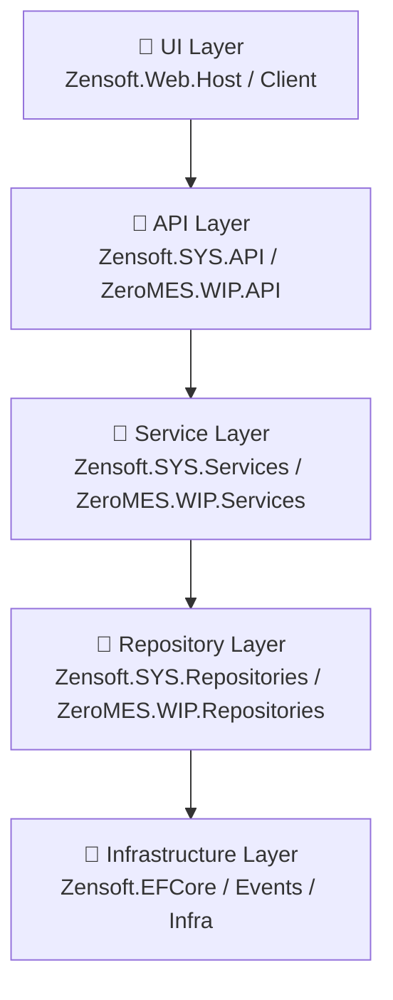
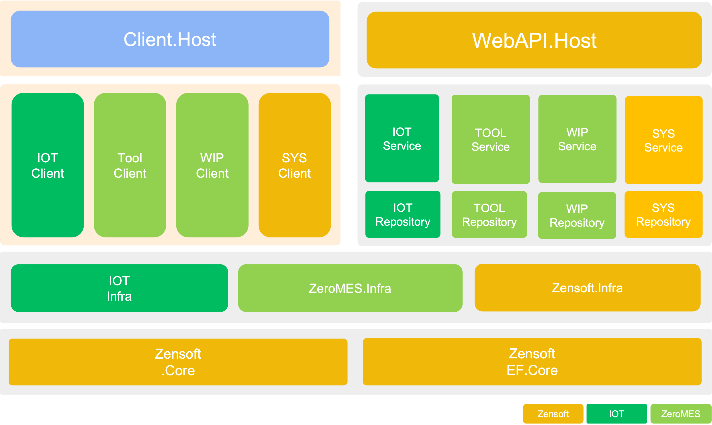

### 🏗️ 開發架構概覽

**解決方案名稱：Zensoft.sln**  
以多層架構（Multi-layer Architecture）進行分層：


---
包含以下主要模組:


### 🔹 基礎核心模組

| 模組名稱 | 說明 |
|----------|------|
| `Zensoft.Core` | 定義核心介面、共用型別、常數、擴充方法等（Domain Layer） |
| `Zensoft.EFCore` | Entity Framework Core 的設定與資料存取的實作（Infrastructure - Persistence） |
| `Zensoft.Infra` | 共用服務與工具函式，例如日誌、快取、時間等通用服務 |
| `Zensoft.Infra.Client` | 提供 Blazor Client 端用的共用服務（例如：通知、Dialog） |

---

### 🔹 後台與 API 模組（Zensoft）

| 模組名稱 | 說明 |
|----------|------|
| `Zensoft.SYS.API` | 系統管理相關 API，例如帳號、角色、權限、系統參數等 |
| `Zensoft.SYS.Repositories` | 專責系統模組資料存取邏輯（Repository Layer） |
| `Zensoft.SYS.Services` | 系統模組的商業邏輯實作（Service Layer） |
| `Zensoft.Web.Host` | 後台網站專案，負責 UI 呈現，使用 Blazor Server |

---

### 🔹 使用者端與 UI 模組

| 模組名稱 | 說明 |
|----------|------|
| `Zensoft.Client` | 前端元件邏輯，使用 Blazor 技術 |
| `Zensoft.MudBlazorExtensions` | 封裝 MudBlazor 的 UI 元件擴充與樣式設定 |
| `ZeroMES.Client.Host` | MES 使用端的 Blazor Web 客戶端（可能是作業端操作介面） |

---

### 🔹 ZeroMES 擴充模組（MES專用）

| 模組名稱 | 說明 |
|----------|------|
| `ZeroMES.WIP.API` | WIP（製程進度）模組的 API |
| `ZeroMES.WIP.Client` | WIP 模組的操作介面（Blazor） |
| `ZeroMES.WIP.Repositories` | WIP 模組的資料存取層 |
| `ZeroMES.WIP.Services` | WIP 模組的商業邏輯處理 |
| `ZeroMES.Events` | WIP 或其他模組的事件處理中心或事件定義 |
| `ZeroMES.Infra` | ZeroMES 專用的基礎功能擴充 |

---

### ⚙️ 開發工具設定與腳本

### ✅ 架構特色整理

- **分層清楚：** 明確區分 Core、Repository、Service、API、Client
- **模組化設計：** 可擴充性高，像是 SYS 模組與 ZeroMES 模組獨立分開開發與維護
- **前後端分離：** 採用 Blazor 技術，搭配 API 通訊
- **依賴反轉：** 使用介面抽象，實作於 Infrastructure 層

---

### 🚀 自動部署與版本控制策略
### 🔹 版本控制（Git）

- 分支策略使用：
  ```
  master     → 正式版本
  develop  → 開發整合
  feature/xxx → 新功能
  hotfix/xxx  → 緊急修復
  ```
- 使用 Git tag 標記版本，如 `v1.0.0`

### 🔹 自動部署（使用 GitHub Actions）

```yaml
# .github/workflows/publish-zensoft.yml
```

---