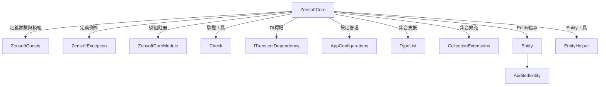

# 📦 Zensoft.Core 技術說明文件

Zensoft.Core 是整個架構的核心模組，主要負責定義：
- 框架常數
- Entity 基礎類別與泛型支援
- Module 模組化設計機制
- DI（依賴注入）標記
- 集合擴充工具
- 錯誤處理與驗證基礎

---

## 📁 結構總覽（Mermaid 類別圖）

---

## 🧱 核心組件說明

### 🔹 `ZensoftConsts.cs`
定義系統名稱、模組名稱、配置節點等共用常數。

### 🔹 `ZensoftCoreModule.cs`
實作 `IZensoftModule`，用於注冊核心服務與初始化機制。

### 🔹 `Check.cs`
提供各類輸入驗證，拋出格式統一的 `ZensoftException`。

### 🔹 `ITransientDependency.cs`
標記類別供 DI 容器註冊為 Transient 使用範圍。

### 🔹 `AuditedEntity<T>` 與 `Entity<T>`
- 提供泛型主鍵支援
- 封裝建立時間、修改人等審計資訊欄位

---

## 🔧 集合擴充工具

位於 `Collections/Extensions/`：
- `CollectionExtensions.cs`
- `EnumerableExtensions.cs`
- `ListExtensions.cs`
- `DictionaryExtensions.cs`

提供更方便的 `.AddIfNotContains()`、`.ForEach()` 等輔助函數，強化 LINQ 操作能力。

---

## 🚀 適用場景

- 作為 Domain Layer 的基礎建設模組
- 提供整個系統的 Entity 架構與驗證基底
- 模組化註冊與跨模組共用工具
