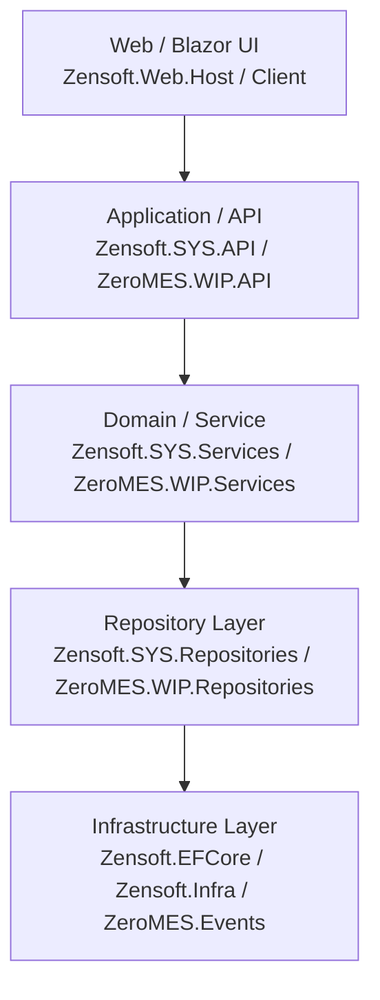
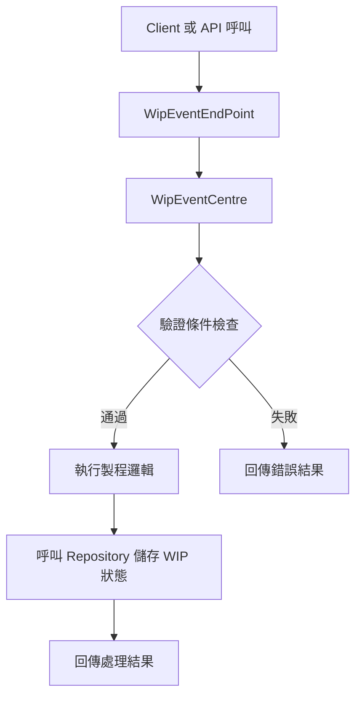

## 🧩 一、各層責任與依賴流程圖（Backend Layered Architecture）

ZeroMES 採用 **典型的分層架構（Layered Architecture）**：



### 各層責任簡述：

- **UI Layer**：前端使用 Blazor，主要負責頁面顯示與操作互動。
- **API Layer**：對外提供資料存取服務，處理驗證、授權與錯誤處理。
- **Service Layer**：封裝商業邏輯，協調 Repository 操作與事件觸發。
- **Repository Layer**：處理實際資料存取（資料庫、EF Core）。
- **Infrastructure**：提供底層工具（例如事件處理、共用介面、快取、時間服務等）。

---

## ⚙️ 二、ZeroMES 的 WIP 流程事件設計

WIP 的事件處理設計集中於 `ZeroMES.Events.WIP`，有三大元件：

### 1. `IWipEventEndPoint`
- 定義了一組 WIP 事件的觸發端點介面，例如進站、出站、過站驗證等。

### 2. `WipEventCentre.cs`
- **事件中心（中樞）**
- 實作具體邏輯，例如執行過站處理、WIP 狀態檢查、流程控制。
- 常見方法為：
  ```csharp
  Task<WipEventResult> DoWipAction(WipActionContext context);
  ```

### 3. `WipEventEndPoint.cs`
- **呼叫事件中心的代理層**
- 做為 service 或 API 的進入點，將參數整理後丟給 `WipEventCentre` 執行。

### 4. `WipEventCentre.RegularValidate.cs`
- 拆分出來的事件驗證邏輯（模組化維護）

📌 **流程**：

## ✅ WIP Event Flow (ZeroMES)



這樣的設計讓：
- API/Service 層只需要呼叫 `WipEventEndPoint` 就能統一處理 WIP 流程
- 驗證與處理邏輯模組化，方便日後擴充
- 支援事件驅動與可測試性

---

## 🚀 三、自動部署與版本控制策略
### 🔹 版本控制（Git）

- 分支策略使用：
  ```
  master     → 正式版本
  develop  → 開發整合
  feature/xxx → 新功能
  hotfix/xxx  → 緊急修復
  ```
- 使用 Git tag 標記版本，如 `v1.0.0`

### 🔹 自動部署（使用 GitHub Actions）

```yaml
# .github/workflows/publish-zensoft.yml
```

---
