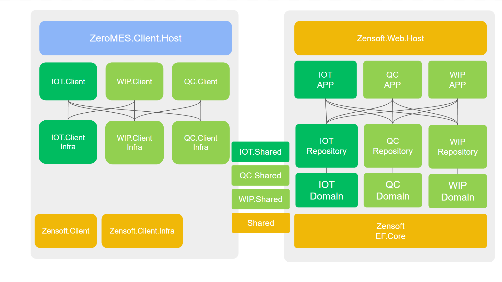

### ✅ **一、整體架構說明與角色**
---

1. **MES 系統簡介**
   - ZeroMES 的用途與目標
   - 為什麼要導入 MES
   - ZeroMES 相較於其他 MES 的特點（模組化、彈性、可擴充）

2. **ZeroMES 架構總覽（高階圖解）**
   - 使用簡易圖說明：前端（WASM）、後端（API）、資料庫、第三方設備整合（IoT、PLC）
   - 哪些是開發者負責？哪些是使用者操作？
   - MVVM 說明

3. **系統角色與使用場景**
   - 使用者角色（作業員、工程師、品保、設備維護……）
   - 各角色操作 ZeroMES 的流程簡圖
   - 與 ERP、WMS、SCADA 的邊界說明

---

### ✅ 二、補充前後端技術說明（給開發者）
---
你列出了很多後端細節與現有架構，但前端 Blazor WASM 的內容偏少，容易讓開發者誤會這是傳統 ASP.NET 專案。

#### ✅ 建議新增章節：
1. **前端架構說明（Blazor WASM）**
   - WASM 與 ASP.NET 傳統架構差異
   - 如何與 API 溝通（HttpClient、DI）
   - 狀態管理方式（如 Scoped DI、StateContainer）

2. **API 設計原則**
   - RESTful 設計
   - 常見 API 結構範例（CRUD、查詢、過帳）
   - Swagger / OpenAPI 文件產出方式

3. **資料交換格式**
   - 使用 Model，透過 AutoMapper 對應到 DTO ( EF Entity)
   - 資料驗證方式（前後端是否一致 DataSafe）

---

### ✅ 三、補充開發者上手指南
---
目前雖有「如何開始」、「建立 IIS」，但缺乏一套從 0 到部署的體驗流程。

#### ✅ 建議新增章節：
1. **開發環境建置**
   - 需要的工具（.NET SDK、VS、DB Management Tool…）
   - 本地開發流程（開 API 網站→ 跑 WASM 網站→ 連測試 DB）

2. **本機端部署說明**
   - 如何啟動本機端 WASM + API（launchSettings.json / IIS）
   - 如何與資料庫串接（config.json / appsettings.json）

3. **CI/CD流程簡介**
   - 是否有自動化測試？
   - 如何從 Dev → Test → Prod？

---

### ✅ 四、補充測試與驗證流程
---
非開發者常關心功能驗證、測試方式。

#### ✅ 建議新增章節：
1. **測試流程說明**
   - 單元測試（Unit Test）
   - 整合測試（Integration Test）
   - 使用者驗收測試（UAT）

2. **常見錯誤排查指南**
   - 前端錯誤（console log）
   - API 錯誤（Exception log / status code）
   - 資料庫錯誤（SQL log）

---

### ✅ 五、補充模組與功能面導覽（非開發者向）
---
讓非技術者了解 ZeroMES 到底能做什麼？有什麼模組？為什麼設計這樣的功能？

#### ✅ 建議新增章節：
1. **ZeroMES 功能模組清單**
   - WIP、EDC、EMS、Report、物料發料、工單追蹤……
   - 每個模組的一句話說明

2. **模組關聯圖**
   - 哪些模組有資料流？如何傳遞？（可以用泳道圖）

3. **常見應用情境（Use Case）**
   - 例如：「自動過帳作業員產線進站」、「自動紀錄設備參數」、「報表追蹤良率變化」

---

### ✅ 六、補充命名與設計範例（降低學習曲線）
---
目前雖有程式撰寫規範與命名規則，但實際範例不明確。

#### ✅ 建議新增章節：
1. **Entity / Event 命名規則與實作範例**
   - Entity 是對應什麼？Event 對應什麼？
   - 一個完整的建構流程範例（從 Entity → Event → Log）

2. **UI 與功能對應說明**
   - 一個簡單的功能（如進站）畫面與背後 API / Event 的流程對照

---

### ✅ 總結補強建議清單

| 模組區塊             | 建議補充章節                             |
|----------------------|------------------------------------------|
| 系統整體說明         | MES簡介、架構總覽、使用角色與場景         |
| 前端開發（WASM）     | 架構說明、Http 通訊、狀態管理             |
| API與後端            | REST 設計、DTO、資料驗證、測試流程       |
| 新手指南             | 開發工具、部署流程、錯誤排查              |
| 非開發者導向         | 功能模組導覽、系統應用案例、資料流說明   |
| 開發細節補充         | 命名範例、Entity / Event 實作流程     |

